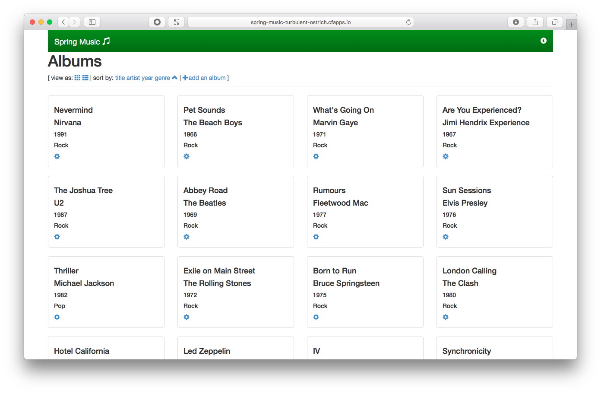

# New Relic APM 連携によるモニタリング
Application Performance Monitoring(APM) を **Marketplace** で提供されるツールを用いて実現します。


## 概要 / 説明
アプリケーションのクラウド化に伴い、アプリケーション監視の領域でAPMツールの利用が注目を浴びています。
ここでは、APMツールとして **[New Relic APM](https://newrelic.com)** を使用します。

### Application Performance Monitoring(APM)
APMとは、文字通りアプリケーションの性能を可視化するツールです。
従来の性能監視と異なる点は、ネットワークを構成する要素の監視や各種のWebアプリケーションの監視、
というような個別に監視するのではなく、アプリケーション全体としての性能を監視する事を目的にしている点です。

また、APM はエンドユーザー視点での性能監視（劣化の検知、把握、分析）を行いますので、
顧客満足度の向上にも繋がります。

#### APM が求められる背景
クラウド化や、仮想化技術の進展によってシステムが複雑化し、
システム管理側が監視すべき範囲が不透明になってしまい、管理側が対応できなくなってきている事があります。

## 前提 / 環境
- [事前作業](https://github.com/shinyay/pcf-workshop-prerequisite/blob/master/README.md)

## 手順 / 解説
### アプリケーションの準備
モニタリングする対象のアプリケーションを作成し、Pivotal Cloud Foundry にデプロイを行います。

#### プロジェクトの作成
GitHub 上に作成済みのプロジェクトをクローン(git clone)しプロジェクトを作成します。

- https://github.com/shinyay/spring-music.git

任意のディレクトリで、以下のコマンドを実行します。

```
$ mkdir pcf-workshop
$ cd pcf-workshop
$ git clone https://github.com/shinyay/spring-music.git
$ cd spring-music
```

#### アプリケーションのビルド
クローンしてきたアプリケーションは、**Gradle** でビルドを行うように構成されています。

アプリケーションのビルドは、以下の gradle コマンドを使用します。

```
$ ./gradlew clean assemble
```

ビルドが完了すると、`build/libs` 配下に Jar ファイルが生成されます。

```
$ ls -l build/libs

total 92304
-rw-r--r--  1 shinyay  staff  47255653 11 28 15:16 spring-music-1.0.jar
```

#### アプリケーションのデプロイ
ビルドしたアプリケーションを Pivotal Cloud Foundry へデプロイします。

アプリケーションのデプロイは、以下のコマンドを使用します。

```
$ cf push
```

<details><summary>実行結果</summary>

```
syanagihara@pivotal.io としてマニフェストから組織 syanagihara-org / スペース development にプッシュしています...
マニフェスト・ファイル /Users/shinyay/workspace/workshop/spring-music/manifest.yml を使用しています
アプリ情報を取得しています...
これらの属性でアプリを作成しています...
+ 名前:       spring-music
  パス:       /Users/shinyay/workspace/workshop/spring-music/build/libs/spring-music-1.0.jar
+ メモリー:   1G
  経路:
+   spring-music-turbulent-ostrich.cfapps.io

アプリ spring-music を作成しています...
経路をマップしています...
ローカル・ファイルをリモート・キャッシュと比較しています...
Packaging files to upload...
ファイルをアップロードしています...
 517.77 KiB / 517.77 KiB [==========================================================================================================================================================================================================================================] 100.00% 2s

API がファイルの処理を完了するのを待機しています...

アプリをステージングし、ログをトレースしています...
   Downloading dotnet_core_buildpack_beta...
   Downloading dotnet_core_buildpack...
   Downloading java_buildpack...
   Downloading staticfile_buildpack...
   Downloading python_buildpack...
   Downloaded dotnet_core_buildpack
   Downloading ruby_buildpack...
   Downloaded staticfile_buildpack
   Downloading nodejs_buildpack...
   Downloaded java_buildpack
   Downloaded ruby_buildpack
   Downloading php_buildpack...
   Downloaded nodejs_buildpack
   Downloading go_buildpack...
   Downloaded dotnet_core_buildpack_beta
   Downloading binary_buildpack...
   Downloaded python_buildpack
   Downloaded binary_buildpack
   Downloaded php_buildpack
   Downloaded go_buildpack
   Cell e222f891-b602-4a15-9b26-fd45771f60ad creating container for instance f6000a29-7bb2-46fb-b4e5-13c293f9686c
   Cell e222f891-b602-4a15-9b26-fd45771f60ad successfully created container for instance f6000a29-7bb2-46fb-b4e5-13c293f9686c
   Downloading app package...
   Downloaded app package (40.6M)
   -----> Java Buildpack v4.16.1 (offline) | https://github.com/cloudfoundry/java-buildpack.git#41b8ff8
   -----> Downloading Jvmkill Agent 1.16.0_RELEASE from https://java-buildpack.cloudfoundry.org/jvmkill/trusty/x86_64/jvmkill-1.16.0_RELEASE.so (found in cache)
   -----> Downloading Open Jdk JRE 1.8.0_192 from https://java-buildpack.cloudfoundry.org/openjdk/trusty/x86_64/openjdk-1.8.0_192.tar.gz (found in cache)
          Expanding Open Jdk JRE to .java-buildpack/open_jdk_jre (1.1s)
          JVM DNS caching disabled in lieu of BOSH DNS caching
   -----> Downloading Open JDK Like Memory Calculator 3.13.0_RELEASE from https://java-buildpack.cloudfoundry.org/memory-calculator/trusty/x86_64/memory-calculator-3.13.0_RELEASE.tar.gz (found in cache)
          Loaded Classes: 19546, Threads: 250
   -----> Downloading Client Certificate Mapper 1.8.0_RELEASE from https://java-buildpack.cloudfoundry.org/client-certificate-mapper/client-certificate-mapper-1.8.0_RELEASE.jar (found in cache)
   -----> Downloading Container Security Provider 1.16.0_RELEASE from https://java-buildpack.cloudfoundry.org/container-security-provider/container-security-provider-1.16.0_RELEASE.jar (found in cache)
   -----> Downloading Spring Auto Reconfiguration 2.5.0_RELEASE from https://java-buildpack.cloudfoundry.org/auto-reconfiguration/auto-reconfiguration-2.5.0_RELEASE.jar (found in cache)
   Exit status 0
   Uploading droplet, build artifacts cache...
   Uploading build artifacts cache...
   Uploading droplet...
   Uploaded build artifacts cache (129B)
   Uploaded droplet (87.3M)
   Uploading complete
   Cell e222f891-b602-4a15-9b26-fd45771f60ad stopping instance f6000a29-7bb2-46fb-b4e5-13c293f9686c
   Cell e222f891-b602-4a15-9b26-fd45771f60ad destroying container for instance f6000a29-7bb2-46fb-b4e5-13c293f9686c

アプリが開始するのを待機しています...

名前:                   spring-music
要求された状態:         started
経路:                   spring-music-turbulent-ostrich.cfapps.io
最終アップロード日時:   Wed 28 Nov 17:13:26 JST 2018
スタック:               cflinuxfs2
ビルドパック:           client-certificate-mapper=1.8.0_RELEASE container-security-provider=1.16.0_RELEASE java-buildpack=v4.16.1-offline-https://github.com/cloudfoundry/java-buildpack.git#41b8ff8 java-main java-opts java-security jvmkill-agent=1.16.0_RELEASE
                        open-jd...

タイプ:           web
インスタンス:     1/1
メモリー使用量:   1024M
開始コマンド:     JAVA_OPTS="-agentpath:$PWD/.java-buildpack/open_jdk_jre/bin/jvmkill-1.16.0_RELEASE=printHeapHistogram=1 -Djava.io.tmpdir=$TMPDIR -Djava.ext.dirs=$PWD/.java-buildpack/container_security_provider:$PWD/.java-buildpack/open_jdk_jre/lib/ext
                  -Djava.security.properties=$PWD/.java-buildpack/java_security/java.security $JAVA_OPTS" && CALCULATED_MEMORY=$($PWD/.java-buildpack/open_jdk_jre/bin/java-buildpack-memory-calculator-3.13.0_RELEASE -totMemory=$MEMORY_LIMIT -loadedClasses=20325
                  -poolType=metaspace -stackThreads=250 -vmOptions="$JAVA_OPTS") && echo JVM Memory Configuration: $CALCULATED_MEMORY && JAVA_OPTS="$JAVA_OPTS $CALCULATED_MEMORY" && MALLOC_ARENA_MAX=2 SERVER_PORT=$PORT eval exec $PWD/.java-buildpack/open_jdk_jre/bin/java
                  $JAVA_OPTS -cp $PWD/. org.springframework.boot.loader.JarLauncher
     状態   開始日時               cpu    メモリー           ディスク           詳細
#0   実行   2018-11-28T08:13:54Z   0.0%   1G の中の 104.5M   1G の中の 170.8M

```
</details>

`経路` に表示される URI にアクセスします。

上記例の場合、`http://pring-music-turbulent-ostrich.cfapps.io` にアクセスします。
以下のような画面が表示される事が確認できます。



### Pivotal Services Marketplace の利用
Pivotal Services Marketplace で提供されるサービスを使用します。

#### サービスの一覧
`cf marketplace` コマンドで利用可能なサービス一覧を表示します。

<details><summary>実行結果</summary>

```
syanagihara@pivotal.io として組織 syanagihara-org / スペース development 内のマーケットプレイスからサービスを取得しています...
OK

サービス                      プラン                                                                                                説明
Greenplum                     Free                                                                                                  Greenplum for Pivotal Cloud Foundry
app-autoscaler                standard                                                                                              Scales bound applications in response to load
blazemeter                    free-tier, basic1kmr*, pro5kmr*                                                                       Performance Testing Platform
cedexisopenmix                opx_global*, openmix-gslb-with-fusion-feeds*                                                          Openmix Global Cloud and Data Center Load Balancer
cleardb                       spark, boost*, amp*, shock*                                                                           Highly available MySQL for your Apps.
cloudamqp                     lemur, tiger*, bunny*, rabbit*, panda*                                                                Managed HA RabbitMQ servers in the cloud
cloudforge                    free, standard*, pro*                                                                                 Development Tools In The Cloud
elephantsql                   turtle, panda*, hippo*, elephant*                                                                     PostgreSQL as a Service
gluon                         free, indie*, business*, enterprise*                                                                  Mobile Synchronization and Cloud Integration
loadimpact                    lifree, li100*, li500*, li1000*                                                                       Performance testing for DevOps
memcachedcloud                100mb*, 250mb*, 500mb*, 1gb*, 2-5gb*, 5gb*, 30mb                                                      Enterprise-Class Memcached for Developers
memcachier                    dev, 100*, 250*, 500*, 1000*, 2000*, 5000*, 7500*, 10000*, 20000*, 50000*, 100000*                    The easiest, most advanced memcache.
metrics-forwarder             unlimited, 4x4000, 60x60000                                                                           Custom metrics service
mlab                          sandbox                                                                                               Fully managed MongoDB-as-a-Service
newrelic                      lite                                                                                                  Manage and monitor your apps
p-circuit-breaker-dashboard   standard*, trial                                                                                      Circuit Breaker Dashboard for Spring Cloud Applications
p-config-server               standard*, trial                                                                                      Config Server for Spring Cloud Applications
p-service-registry            standard*, trial                                                                                      Service Registry for Spring Cloud Applications
pubnub                        free                                                                                                  Build Realtime Apps that Scale
quotaguard                    starter, spike*, micro*, medium*, large*, enterprise*, premium*, deluxe*, super*, mega*, unlimited*   High Availability Enterprise-Ready Static IPs
rediscloud                    100mb*, 250mb*, 500mb*, 1gb*, 2-5gb*, 5gb*, 10gb*, 50gb*, 30mb                                        Enterprise-Class Redis for Developers
scheduler-for-pcf             standard                                                                                              Scheduler service
searchify                     small*, plus*, pro*                                                                                   Custom search you control
searchly                      small*, micro*, professional*, advanced*, starter, business*, enterprise*                             Search Made Simple. Powered-by Elasticsearch
sendgrid                      free, bronze*, silver*                                                                                Email Delivery. Simplified.
ssl                           basic*                                                                                                Upload your SSL certificate for your app(s) on your custom domain
stream                        free, starter*, growth*, pro*                                                                         Timelines, Build Scalable Newsfeeds & Activity Streams
streamdata                    spring, creek*, brook*                                                                                Future-proof your APIs !

* これらのサービス・プランには関連コストが伴います。 サービス・インスタンスを作成すると、このコストが発生します。

ヒント:  特定のサービスの個々のプランの説明を表示するには、'cf marketplace -s SERVICE' を使用します。
```
</details>

サービス一覧に `newrelic` が見つかります。また、newrelic が提供しているプランは無償での利用可能な `lite` がある事が確認できます。


## まとめ / 振り返り

### 参考
- [Monitor and Measure Your Way to Successful Digital Transformation with Pivotal and New Relic](https://blog.newrelic.com/product-news/pivotal-springone-monitoring-digital-transformation/)
