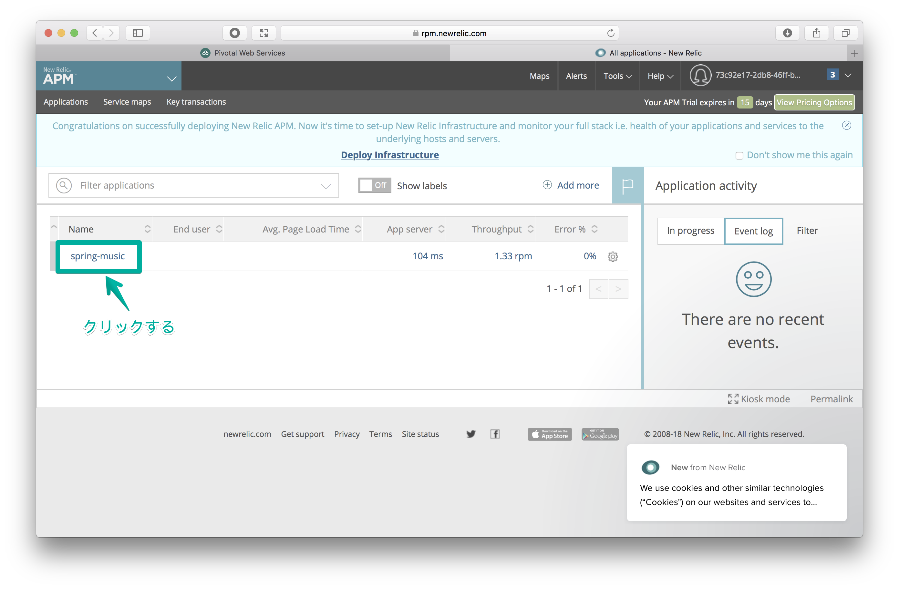

# New Relic APM 連携によるモニタリング
Application Performance Monitoring(APM) を **Marketplace** で提供されるツールを用いて実現します。


## 概要 / 説明
アプリケーションのクラウド化に伴い、アプリケーション監視の領域でAPMツールの利用が注目を浴びています。
ここでは、APMツールとして **[New Relic APM](https://newrelic.com)** を使用します。

### Application Performance Monitoring(APM)
APMとは、文字通りアプリケーションの性能を可視化するツールです。
従来の性能監視と異なる点は、ネットワークを構成する要素の監視や各種のWebアプリケーションの監視、
というような個別に監視するのではなく、アプリケーション全体としての性能を監視する事を目的にしている点です。

また、APM はエンドユーザー視点での性能監視（劣化の検知、把握、分析）を行いますので、
顧客満足度の向上にも繋がります。

#### APM が求められる背景
クラウド化や、仮想化技術の進展によってシステムが複雑化し、
システム管理側が監視すべき範囲が不透明になってしまい、管理側が対応できなくなってきている事があります。

## 前提 / 環境
- [事前作業](https://github.com/shinyay/pcf-workshop-prerequisite/blob/master/README.md)

## 手順 / 解説
### アプリケーションの準備
モニタリングする対象のアプリケーションを作成し、Pivotal Cloud Foundry にデプロイを行います。

#### プロジェクトの作成
GitHub 上に作成済みのプロジェクトをクローン(git clone)しプロジェクトを作成します。

- https://github.com/shinyay/spring-music.git

任意のディレクトリで、以下のコマンドを実行します。

```
$ mkdir pcf-workshop
$ cd pcf-workshop
$ git clone https://github.com/shinyay/spring-music.git
$ cd spring-music
```

#### アプリケーションのビルド
クローンしてきたアプリケーションは、**Gradle** でビルドを行うように構成されています。

アプリケーションのビルドは、以下の gradle コマンドを使用します。

```
$ ./gradlew clean assemble
```

ビルドが完了すると、`build/libs` 配下に Jar ファイルが生成されます。

```
$ ls -l build/libs

total 92304
-rw-r--r--  1 shinyay  staff  47255653 11 28 15:16 spring-music-1.0.jar
```

#### アプリケーションのデプロイ
ビルドしたアプリケーションを Pivotal Cloud Foundry へデプロイします。

アプリケーションのデプロイは、以下のコマンドを使用します。
`--no-start` オプションをつけて起動しないようにしておきます。

```
$ cf push --no-start
```

### Pivotal Services Marketplace の利用
**Pivotal Services Marketplace** で提供されるサービスを利用して **New Relic** を使用します。

#### サービスの一覧
`cf marketplace` コマンドで利用可能なサービス一覧を表示します。

<details><summary>実行結果</summary>

```
syanagihara@pivotal.io として組織 syanagihara-org / スペース development 内のマーケットプレイスからサービスを取得しています...
OK

サービス                      プラン                                                                                                説明
Greenplum                     Free                                                                                                  Greenplum for Pivotal Cloud Foundry
app-autoscaler                standard                                                                                              Scales bound applications in response to load
blazemeter                    free-tier, basic1kmr*, pro5kmr*                                                                       Performance Testing Platform
cedexisopenmix                opx_global*, openmix-gslb-with-fusion-feeds*                                                          Openmix Global Cloud and Data Center Load Balancer
cleardb                       spark, boost*, amp*, shock*                                                                           Highly available MySQL for your Apps.
cloudamqp                     lemur, tiger*, bunny*, rabbit*, panda*                                                                Managed HA RabbitMQ servers in the cloud
cloudforge                    free, standard*, pro*                                                                                 Development Tools In The Cloud
elephantsql                   turtle, panda*, hippo*, elephant*                                                                     PostgreSQL as a Service
gluon                         free, indie*, business*, enterprise*                                                                  Mobile Synchronization and Cloud Integration
loadimpact                    lifree, li100*, li500*, li1000*                                                                       Performance testing for DevOps
memcachedcloud                100mb*, 250mb*, 500mb*, 1gb*, 2-5gb*, 5gb*, 30mb                                                      Enterprise-Class Memcached for Developers
memcachier                    dev, 100*, 250*, 500*, 1000*, 2000*, 5000*, 7500*, 10000*, 20000*, 50000*, 100000*                    The easiest, most advanced memcache.
metrics-forwarder             unlimited, 4x4000, 60x60000                                                                           Custom metrics service
mlab                          sandbox                                                                                               Fully managed MongoDB-as-a-Service
newrelic                      lite                                                                                                  Manage and monitor your apps
p-circuit-breaker-dashboard   standard*, trial                                                                                      Circuit Breaker Dashboard for Spring Cloud Applications
p-config-server               standard*, trial                                                                                      Config Server for Spring Cloud Applications
p-service-registry            standard*, trial                                                                                      Service Registry for Spring Cloud Applications
pubnub                        free                                                                                                  Build Realtime Apps that Scale
quotaguard                    starter, spike*, micro*, medium*, large*, enterprise*, premium*, deluxe*, super*, mega*, unlimited*   High Availability Enterprise-Ready Static IPs
rediscloud                    100mb*, 250mb*, 500mb*, 1gb*, 2-5gb*, 5gb*, 10gb*, 50gb*, 30mb                                        Enterprise-Class Redis for Developers
scheduler-for-pcf             standard                                                                                              Scheduler service
searchify                     small*, plus*, pro*                                                                                   Custom search you control
searchly                      small*, micro*, professional*, advanced*, starter, business*, enterprise*                             Search Made Simple. Powered-by Elasticsearch
sendgrid                      free, bronze*, silver*                                                                                Email Delivery. Simplified.
ssl                           basic*                                                                                                Upload your SSL certificate for your app(s) on your custom domain
stream                        free, starter*, growth*, pro*                                                                         Timelines, Build Scalable Newsfeeds & Activity Streams
streamdata                    spring, creek*, brook*                                                                                Future-proof your APIs !

* これらのサービス・プランには関連コストが伴います。 サービス・インスタンスを作成すると、このコストが発生します。

ヒント:  特定のサービスの個々のプランの説明を表示するには、'cf marketplace -s SERVICE' を使用します。
```
</details>

サービス一覧に `newrelic` が見つかります。また、newrelic が提供しているプランは無償での利用可能な `lite` がある事が確認できます。
このサービスインスタンスを作成して利用します。

### New Relic インスタンスの準備

**Marketpacle** で提供されるサービスは、使用するプランを選択して、サービスインスタンスを作成してから使用します。
また、そのサービスインスタンスがどのデプロイされているアプリケーションから使用されるかを定義するため、 **バインド** 操作と呼ばれるアプリケーションとの関連付けを行います。

#### New Relic インスタンスの作成
New Relic のサービスインスタンスを作成するには、
`$ cf create-service newrelic lite <サービスインスタンス名>` を実行します。

<details><summary>実行結果</summary>

```
$ cf create-service newrelic lite hello-newrelic

syanagihara@pivotal.io としてサービス・インスタンス hello-newrelic を組織 syanagihara-org / スペース development 内に作成しています...
OK
```
</details>

#### New Relic インスタンスとアプリケーションのバインド
アプリケーションとサービスインスタンスのバインドには、
`$ cf bind-service <アプリケーション名> <サービスインスタンスインスタンス名>
` を実行します。

```
$ cf bind-service spring-music hello-newrelic
```

#### アプリケーションの開始
停止していたアプリケーションを起動します。
予め停止していたため、この初回起動時にバインド舌サービスの情報を反映位した状態で起動されます。

```
$ cf start spring-music
```

#### New Relic インスタンスの確認
`$ cf service <サービスインスタンス>` でサービスインスタンスの詳細情報を表示します。

<details><summary>実行結果</summary>

```
$ cf service hello-newrelic

syanagihara@pivotal.io として組織 syanagihara-org / スペース development 内のサービス hello-newrelic の情報を表示しています...

名前:                   hello-newrelic
サービス:               newrelic
タグ:
プラン:                 lite
説明:                   Manage and monitor your apps
ドキュメンテーション:   http://docs.run.pivotal.io/marketplace/services/newrelic/
ダッシュボード:         https://cloudfoundry.appdirect.com/api/custom/cloudfoundry/v2/sso/start?serviceUuid=7c0cc140-aace-4f86-8b5d-493db16a2460

サービス hello-newrelic からの最後の操作の状況を表示しています...

状況:         create succeeded
メッセージ:
開始済み:     2018-11-29T12:09:28Z
更新済み:     2018-11-29T12:09:28Z

バインド済みアプリ:
名前           バインディング名   状況               メッセージ
spring-music                      create succeeded
```
</details>

### New Relic インスタンスのサービスキー作成
作成したサービスインスタンスにの New Relic のライセンスキー情報を反映します。
Apps Manager 上で New Relic のサービスインスタンスを見つけ、サービスキーを作成する事でライセンスキーを反映することができます。

#### Apps Manager へアクセス
まず、ブラウザから Apps Manager にアクセスします。

- [Apps Manager - https://console.run.pivotal.io](https://console.run.pivotal.io)

使用しているスペース (ここでは `development`) を選択し `Service` タブをクリックします。
すると、以下のように サービス一覧の中に New Relic のサービスインスタンスが確認できます。


#### サービスキー作成


### New Relic APM へのアクセス
New Relic のダッシュボードにアクセスし、アプリケーション情報を確認します。

#### New Relic のダッシュボードにアクセス
`$ cf service <サービスインスタンス>` で確認したサービスインスタンス情報にダッシュボード画面の URL 情報がありました。
その URL にアクセスします。

上記の例では、以下のように記述されていました。

- `ダッシュボード:         https://cloudfoundry.appdirect.com/api/custom/cloudfoundry/v2/sso/start?serviceUuid=7c0cc140-aace-4f86-8b5d-493db16a2460`

初回アクセス時は、以下のようなサービス・アグリーメントが表示されます。
`I agree` をクリックしてください。


New Relic APM 画面にバインドしておいたアプリケーションが表示されている事が確認できます。


### New Relic APM の操作
New Relic で確認できる情報を確認します。

まず、モニタリングしている情報を表示したいアプリケーションをクリックします。


左部メニューから各種情報を表示できます。

表示する情報は大きく以下のカテゴリに分類されます。

- モニタリング
- イベント
- レポート

#### 概要情報
左部メニューに表示される **Overview** を選択します。

トランザクション状況やスループットなどの各種情報が一覧表示されます。


#### サービスマップ
アプリケーションが利用する外部システムや連携するアプリケーションなどの関係を可視化します。

今回の例では、組み込みの `H2 Database` を使用している事が確認できます。


#### トランザクション
アプリケーションへの各種リクエストの割合やスループットをグラフ表示します。


#### データベース
アプリケーションが利用しているデータベースに対するリクエストの割合や処理にかかった時間をグラフ表示します。


#### 外部サービス
外部連携している宛先や呼び出し回数、またその外部サービスからのレスポンスタイムをグラフ表示します。


#### JVM情報
アプリケーションが稼動している環境の JVM 情報を以下のような観点で表示します。

- ヒープ使用情報
- Eden / Survivor 領域の使用情報
- Old 領域
- 非ヒープ(ネイティブ)領域
- GC 時間


#### エラーイベント
アプリケーションで発生したエラーイベントを表示します。


#### スケーラビリティ分析レポート
アプリの負荷と比較した応答時間、データベース利用率、およびCPU使用率を散布図で表示します。


#### データベース接続構成のモニタリング
ここまでのアプリケーションの稼動は、組み込みデータベースの利用でした。
そのため、データは永続化されません。アプリケーションの停止とともにデータは消失する構成になっています。
そこで、外部にたてたデータベースにバインドする構成に変更してみます。

##### データベースインスタンスの作成
PostgreSQL インスタンスを作成します。
`$ cf create-service elephantsql turtle <サービスインスタンス名>` で作成を行います。

```
$ cf create-service elephantsql turtle hello-elephant
```
##### データベースインスタンスとアプリケーションのバインド
PostgreSQL インスタンスとアプリケーションをバインドし、外部のデータベースを使用できるようにします。
バインドするには、以下のコマンドを使用します。また、バインド後に再起動します。

```
$ cf bind-service spring-music hello-elephant
$ cf restage spring-music
```

##### サービスマップ
アプリケーションの構成が、PostgreSQL との接続に変更されている事が確認できます。


## まとめ / 振り返り
New Relic APM でアプリケーションのモニタリングを行う際に、特にアプリケーション側に New Relic のエージェントモジュールの導入を行っていません。

これは、Java アプリケーションのビルド時に利用される **Java Buildpack** に New Relic の構成を自動で行うフレームワークが含まれているため、開発者は特にエージェントの構成を意識する事なく、New Relic を利用する事ができます。

- [New Relic Agent Framework](https://github.com/cloudfoundry/java-buildpack/blob/master/docs/framework-new_relic_agent.md)

### 参考
- [Monitor and Measure Your Way to Successful Digital Transformation with Pivotal and New Relic](https://blog.newrelic.com/product-news/pivotal-springone-monitoring-digital-transformation/)

- [New Relic APM Document](https://newrelic.degica.com/docs/apm)
